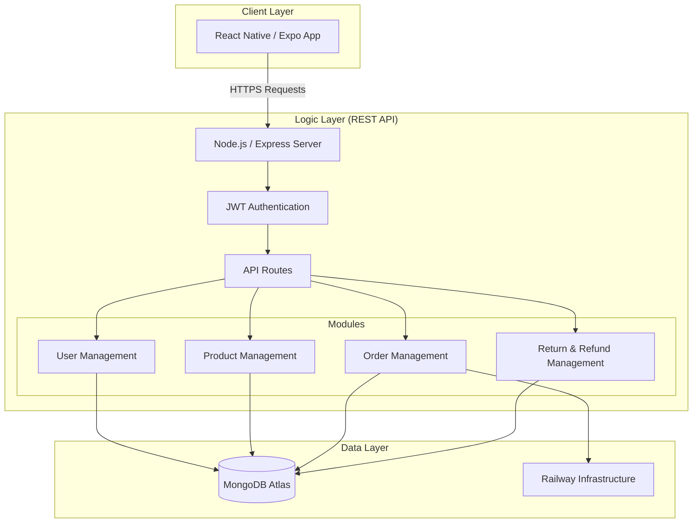
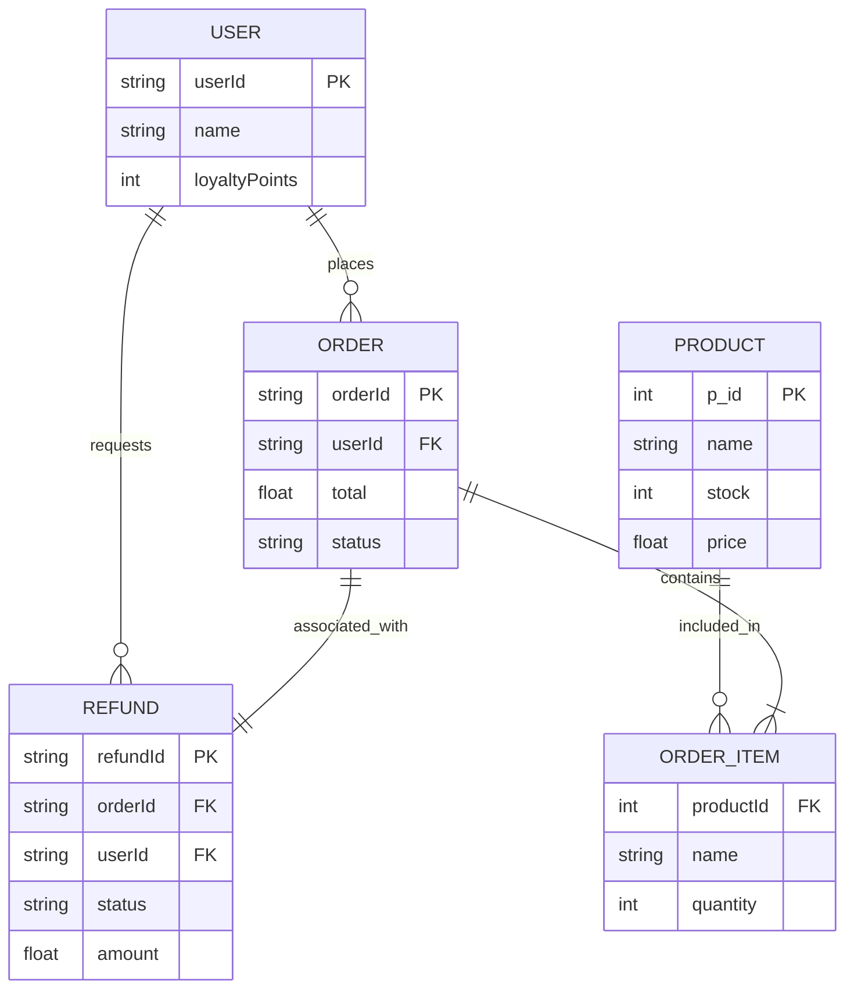

# SE2020 Assignment Submission Documents (CALIDI BOUTIQUE)

This document contains the master content for your final submission. Follow the instructions at the end to create your ZIP file.

---

## 01. System Architecture Diagram
Copy this code into [Mermaid Live Editor](https://mermaid.live/) to generate your PNG.



---

## 02. Database Schema Diagram
Copy this code into [Mermaid Live Editor](https://mermaid.live/) to generate your PNG.



---

## 03. API Endpoint Table

| Module | Method | Endpoint | Description | Auth |
| :--- | :--- | :--- | :--- | :--- |
| **User** | `POST` | `/api/auth/signup` | New Customer Registration | No |
| **User** | `POST` | `/api/auth/login` | Secure JWT Login | No |
| **User** | `GET` | `/api/auth/me` | Profile & Loyalty Info | Yes |
| **User** | `DELETE`| `/api/auth/account` | Remove User Account | Yes |
| **Product** | `GET` | `/api/products` | Public Catalog List | No |
| **Product** | `POST` | `/api/admin/products` | Create Product (Admin) | Admin |
| **Product** | `PUT` | `/api/admin/products/:id` | Update Stock/Catalog | Admin |
| **Product** | `DELETE`| `/api/admin/products/:id` | Remove Product (Admin) | Admin |
| **Order** | `POST` | `/api/orders` | Checkout & Reserve Stock | Yes |
| **Order** | `POST` | `/api/orders/:id/pay` | Process Payment | Yes |
| **Order** | `GET` | `/api/orders` | User Purchase History | Yes |
| **Order** | `PUT` | `/api/admin/orders/:id` | Update Status (Admin) | Admin |
| **Refund** | `POST` | `/api/refunds/request/:id` | Submit Refund Request | Yes |
| **Refund** | `GET` | `/api/admin/refunds` | View Pending Requests | Admin |
| **Refund** | `PUT` | `/api/admin/refunds/:id` | Approve/Reject Refund | Admin |
| **Refund** | `GET` | `/api/refunds/status/:id` | Track Refund Progress | Yes |

---

## 04. Team Responsibility (4 Members)

| Member | Role | Responsibilities |
| :--- | :--- | :--- |
| **Member 1** | User & Security | Auth (JWT), Profile CRUD, Loyalty Tiers, Points logic |
| **Member 2** | Product & Inventory | Catalog CRUD, GridFS Images, Stock Alerts, Category filters |
| **Member 3** | Order & Payment | Checkout pipeline, Stripe Payment, Invoicing, Order history |
| **Member 4** | Return & Refund | Refund Request CRUD, Stock restoration, Refund Dashboard |

### Master CRUD Operation Table:
| Module | Member | Create (C) | Read (R) | Update (U) | Delete (D) |
| :--- | :--- | :--- | :--- | :--- | :--- |
| **User & Security** | Member 01 | User Signup / Registration | Profile Fetch / Loyalty Info | Profile Update / Tier Logic | Account Removal |
| **Product & Stock** | Member 02 | New Product / Image Upload | Catalog Browse / Stock Monitor | Batch-Restock / Price Edit | Product Removal |
| **Order & Sales** | Member 03 | Order Placement / Checkout | Purchase History / Invoice | Status Update (Paid/Shipped) | Cancellation (Logic-Delete) |
| **Return & Refund**| Member 04 | Refund Request Submission | Admin Dashboard / Tracking | Approval Logic / Status Change | Request Rejection |


---

## 05. README.txt

```text
SE2020 Assignment Submission - CALIDI Boutique

01). GitHub Repository Link
GitHub Repository: https://github.com/samali12345/calidi-app

02). Team Details
Group Number: [ENTER_GROUP_NUMBER]
Member 1: [ITxxxx] - [NAME] - User Management
Member 2: [ITxxxx] - [NAME] - Product Management
Member 3: [ITxxxx] - [NAME] - Order Management
Member 4: [ITxxxx] - [NAME] - Refund Management

03). Deployment Details
Backend URL: https://calidi-app-production.up.railway.app
App Type: Expo React Native (Android)
```

---

### FINAL SUBMISSION INSTRUCTIONS:
1. Create a folder named `SE2020_Group_XX_Submission`.
2. Save Diagrams as `System_Architecture_Diagram.png` and `Database_Schema_Diagram.png`.
3. Save the API Table and Team Responsibility as PDFs.
4. Save the README exactly as shown above as a `.txt` file.
5. ZIP the folder. **(IMPORTANT: DO NOT include source code in the ZIP)**
